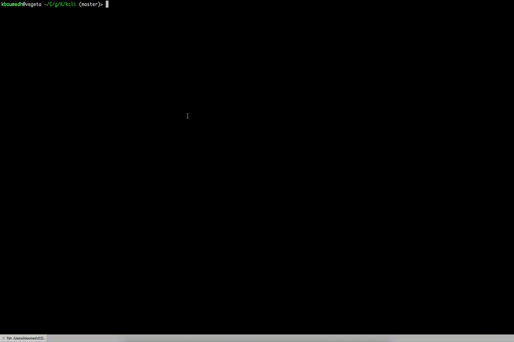

# kcli repository

[](https://hub.docker.com/r/karmab/kcli/builds/)
[](https://travis-ci.org/karmab/kcli)
[](https://copr.fedorainfracloud.org/coprs/karmab/kcli/package/kcli)
[](https://microbadger.com/images/karmab/kcli "Get your own image badge on microbadger.com")


## Demo!



# Description

This tool is meant to interact with existing virtualization providers (libvirt, KubeVirt, oVirt, OpenStack, VMware vSphere, GCP and AWS) and to easily deploy and customize VMs from cloud images.

You can also interact with those VMs (list, info, ssh, start, stop, delete, console, serialconsole, add/delete disk, add/delete nic, ...).

Furthermore, you can deploy VMs using predefined profiles, several at once using plan files or entire products for which plans were already created for you.

Refer to the [documentation](https://kcli.readthedocs.io) for more information

## Quick Start

```
curl https://raw.githubusercontent.com/karmab/kcli/master/install.sh | sh
```

Deploy your first vm with:

```
kcli download image centos7
kcli create vm -i centos7 myvm
kcli list vm
# wait 5-10 seconds for vm to grab an ip
kcli ssh myvm
kcli delete vm
```

##  What you can do

- Interact with all the virtualization providers using a single tool
- Declare all your objects (VM, containers, networks, ansible playbooks, ...) in a single yaml plan file with a simple syntax
- Customize a plan deployment using parameters and Jinja templating
- Adjust VMs from a plan (memory, CPU, flavor, disks and NICs) to match what's defined in the plans
- Inject all configuration with cloud-init/Ignition or the equivalent in cloud providers
- Use profiles to launch VMs with same hardware characteristics
- Launch a plan from an URL
- Share your plan or use existing ones from Github repo as products
- Use the existing plans to deploy Kubernetes, OpenShift, OpenStack, oVirt, kubevirt, ...
- Use the existing cloud images for each distribution
- Easily share private keys between your VMs
- Handle dns entries for the VMs
- Automatically subscribe your RHEL VMs
- Get a push button notification when a vm has finished its deployment
- Alternatively use web UI to do the same

## Contributors

See [contributors on GitHub](https://github.com/karmab/kcli/graphs/contributors)

## Copyright

Copyright 2017-2019 Karim Boumedhel

Licensed under the Apache License, Version 2.0 (the "License");
you may not use this file except in compliance with the License.
You may obtain a copy of the License at

    http://www.apache.org/licenses/LICENSE-2.0

Unless required by applicable law or agreed to in writing, software
distributed under the License is distributed on an "AS IS" BASIS,
WITHOUT WARRANTIES OR CONDITIONS OF ANY KIND, either express or implied.
See the License for the specific language governing permissions and
limitations under the License.

## Problems?

Open an issue or join us on [kcli slack channel](https://app.slack.com/client/T09NY5SBT/CU76B52JE)

Mc Fly!!!

karmab
